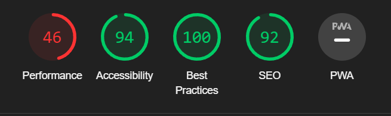
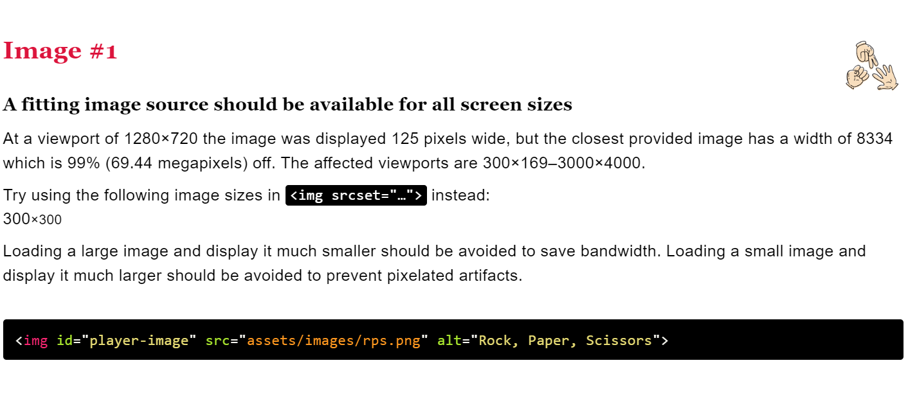
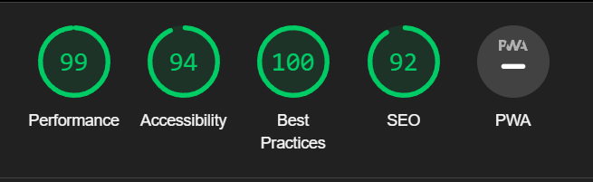

# Rock, Paper, Scissors

Rock, Paper, Scissors is a designed to show that Javascript can be used to make a fun interactive game of chance. This site is aimed at those who want to play against the computer in a heads up game of chance.

## Features
- __The Rock, Paper, Scissors Heading__

  - Featured at the top of the page, the heading is simply to outline the name of the game.

- __The Game Area__

  - This section will allow the user to play the game. The user will be able to easily see buttons they can use to choose either rock, paper or scissors.

- __The Scores section__

  - The scores section is where the user can see who is winning in their game against the computer, this section updates as the player makes their seletion.
  - Once the use makes a choice, the computer does the same and then the image is updated accordingly, when a winner is determined the score updates.

- __The Results Area__

  - This section shows the result of both choices and displays a message detailing if it was a win, loss or draw.

## Testing 

- When testing this project I made sure to check on other devices, after deployment I used my iPhone 13 and it worked as expected. Other tests I did included the lighthouse test, on my first test you can see that I got a very low score on performance,this was because my images were sized incorrectly, I used Lint images to check the responsiveness of the images and as you can see here it outlines the issue,I then resized the images and as you can see it improved the score significantly. 

- While testing I noticed that my style.css would not change for the computer-score div, after some time I noticed that I had placed the closing /div tag in the wrong line of code as you can see here, once I placed it at the correct place then my styling worked as intended.

### Validator Testing 

- HTML
    - No errors were returned when passing through the official [W3C validator](https://validator.w3.org/nu/?doc=https%3A%2F%2Fjakecun.github.io%2FRPS%2F)
- CSS
    - No errors were found when passing through the official [(Jigsaw) validator](https://jigsaw.w3.org/css-validator/validator?uri=https%3A%2F%2Fjakecun.github.io%2FRPS%2F&profile=css3svg&usermedium=all&warning=1&vextwarning=&lang=en)
- JavaScript
    - No errors were found when passing through the official [Jshint validator](https://jshint.com/)
      - The following metrics were returned: 
      - There are 6 functions in this file.
      - Function with the largest signature take 2 arguments, while the median is 1.
      - Largest function has 8 statements in it, while the median is 3.
      - The most complex function has a cyclomatic complexity value of 3 while the median is 2.

### Unfixed Bugs

There are no unfixed bugs.
## Deployment

This section should describe the process you went through to deploy the project to a hosting platform (e.g. GitHub) 

- The site was deployed to GitHub pages. The steps to deploy are as follows: 
  - In the GitHub repository, navigate to the Settings tab 
  - From the source section drop-down menu, select the Master Branch
  - Once the master branch has been selected, the page will be automatically refreshed with a detailed ribbon display to indicate the successful deployment. 

The live link can be found here - https://jakecun.github.io/RPS/

## Credits 

### Media

- The images used for the game icons and were taken from https://pngtree.com/so/rock-paper-scissors
- The image for the favicon was sourced from https://www.flaticon.com/free-icon/rock-paper-scissors_6831874?term=rock+paper+scissors&page=1&position=61&origin=tag&related_id=6831874