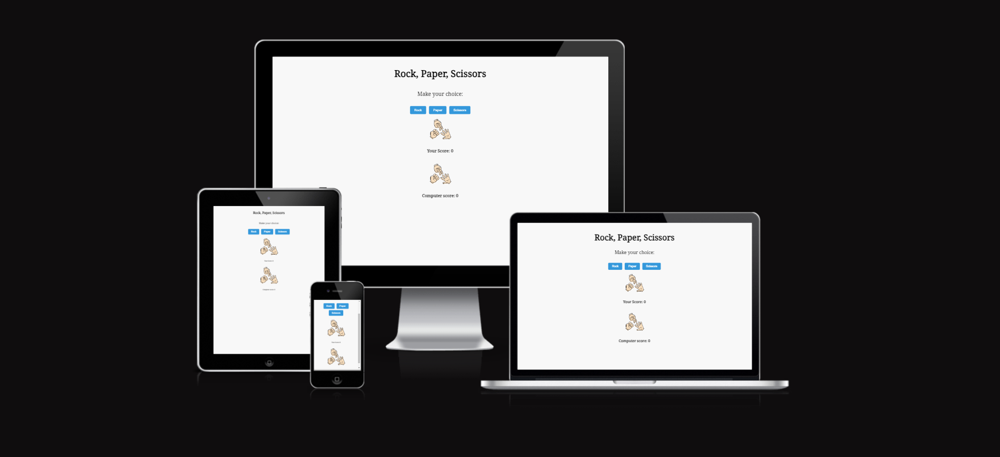
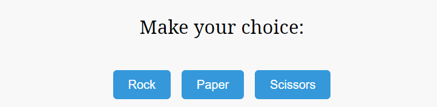
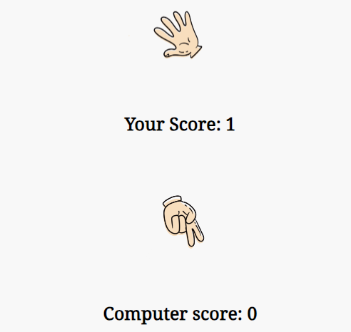
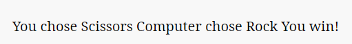

# Love Maths

In this section, you will include one or two paragraphs providing an overview of your project. Essentially, this part is your sales pitch. At this stage, you should have a name for your project so use it! Don’t introduce the project as a Portfolio project for the diploma. In this section, describe what the project hopes to accomplish, who it is intended to target and how it will be useful to the target audience. 

For example, Love Maths is a site that hopes to demonstrate how pure JavaScript works in a real-world context. The site will be targeted toward people who not only love to implement more advanced JavaScript concepts but also maths. Love Maths is a fully responsive JavaScript maths game that will allow users to add, subtract, multiply and divide numbers. 

## Features
- __The Rock, Paper, Scissors Heading__

  - Featured at the top of the page, the heading is simply to outline the name of the game.

- __The Game Area__

  - This section will allow the user to play the game. The user will be able to easily see buttons they can use to choose either rock, paper or scissors.

- __The Scores section__

  - The scores section is where the user can see who is winning in their game against the computer, this section updates as the player makes their seletion.
  - Once the use makes a choice, the computer does the same and then the image is updated accordingly, when a winner is determined the score updates.

- __The Results Area__

  - This section shows the result of both choices and displays a message detailing if it was a win, loss or draw.

## Testing 

In this section, you need to convince the assessor that you have conducted enough testing to legitimately believe that the site works well. Essentially, in this part you will want to go over all of your project’s features and ensure that they all work as intended, with the project providing an easy and straightforward way for the users to achieve their goals.

In addition, you should mention in this section how your project looks and works on different browsers and screen sizes.

You should also mention in this section any interesting bugs or problems you discovered during your testing, even if you haven't addressed them yet.

If this section grows too long, you may want to split it off into a separate file and link to it from here.

### Validator Testing 

- HTML
    - No errors were returned when passing through the official [W3C validator](https://validator.w3.org/nu/?doc=https%3A%2F%2Fjakecun.github.io%2FRPS%2F)
- CSS
    - No errors were found when passing through the official [(Jigsaw) validator](https://jigsaw.w3.org/css-validator/validator?uri=https%3A%2F%2Fjakecun.github.io%2FRPS%2F&profile=css3svg&usermedium=all&warning=1&vextwarning=&lang=en)
- JavaScript
    - No errors were found when passing through the official [Jshint validator](https://jshint.com/)
      - The following metrics were returned: 
      - There are 6 functions in this file.
      - Function with the largest signature take 2 arguments, while the median is 1.
      - Largest function has 8 statements in it, while the median is 3.
      - The most complex function has a cyclomatic complexity value of 3 while the median is 2.

### Unfixed Bugs

There are no unfixed bugs.
## Deployment

This section should describe the process you went through to deploy the project to a hosting platform (e.g. GitHub) 

- The site was deployed to GitHub pages. The steps to deploy are as follows: 
  - In the GitHub repository, navigate to the Settings tab 
  - From the source section drop-down menu, select the Master Branch
  - Once the master branch has been selected, the page will be automatically refreshed with a detailed ribbon display to indicate the successful deployment. 

The live link can be found here - https://jakecun.github.io/RPS/

## Credits 

### Media

- The images used for the game icons and were taken from https://pngtree.com/so/rock-paper-scissors
- The image for the favicon was sourced from https://www.flaticon.com/free-icon/rock-paper-scissors_6831874?term=rock+paper+scissors&page=1&position=61&origin=tag&related_id=6831874